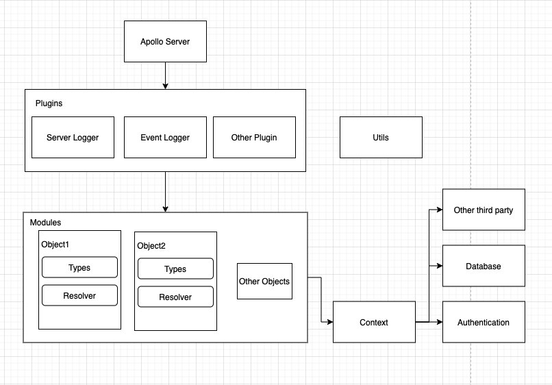

# Foodspot GraphQL Server

## Purpose
This is the GraphQL server for our Foodspot application.



## Getting started

### Local setup
1. Create a `.env` file with the following values
    ```shell
    CLOUDANT_ID='<CLOUDANT_ID>'
    CLOUDANT_API_KEY='<CLOUDANT_API_KEY>'
    TOKEN_SECRET='<TOKEN_SECRET>'
    NODE_ENV='development'
    ```
2. Start up the app
    ```shell
    npm install # install all dependencies
    npm start # start the server
    ```

### Containerised setup

1. Modify the `docker-compose.yml` to include the environment variables
    ```shell
        environment:
          - CLOUDANT_ID=''
          - CLOUDANT_API_KEY=''
          - TOKEN_SECRET=''
    ```
2. Run the containers using `docker-compose up -d`

## Development

If you want to use your local server for development, we expose a public tunnel
using ngrok. This is only created if the `NODE_ENV` variable is set to
`development. The URL is printed when the server is initialised.

```shell
Server is now listening on http://localhost:8080/graphql
Serving ngrok at: https://f012-175-39-245-238.ngrok.io/graphql
```
